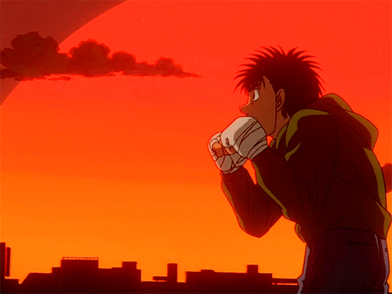

<h1 align="center">💠 Welcome 👋, 𝘐'𝘮 𝘕𝘢𝘷𝘢𝘳𝘢𝘫𝘢! ナヴァ・ラジャ 💠</h1>

  

 

<h1 align="center">𝗔𝗕𝗢𝗨𝗧 𝗠𝗘</h1>

<ul>
  
 🎓 Currently studying at <b>EPITA, France 

  
 🔭 I'm currently working on <b>RAG systems, AI agents & Deep Learning projects 

  
 💼 ML/AI Engineer specializing in <b>LLMs, RAG, Python & Deep Learning 

  
 🎮 Gaming enthusiast with <b>FPS gamer spirit 

  
 📫 How to reach me: <b>mannepallinavaraja@gmail.com 

</ul>

</dev>
 

<h1 align="center">𝗞𝗡𝗢𝗪𝗟𝗘𝗗𝗚𝗘</h1>

  
ML/DL Engineer & AI specialist building intelligent systems with RAG, LLMs, and deep learning. Expertise in data engineering, deploying production-ready AI solutions, and creating scalable ML pipelines. 

  

    
    
    
    
    
    
    
    
    
    
    
    
    
  

  

 

<h1 align="center">𝗣𝗥𝗢𝗝𝗘𝗖𝗧𝗦</h1>

  
| Project | Tech Stack | Status |
|---------|-----------|--------|
| [Research RAG Chatbot](https://github.com/navaraja20/Research_RAG_Chatbot) | RAG, LLMs, Ollama, LangChain | 🔥 Active |
| [Chat Scholar Llama](https://github.com/navaraja20/Chat_Scholar_llama) | AI, NLP, LLMs | 🔥 Active |
| [Solar Panel Classification](https://github.com/navaraja20/Solar_Panel_Classification) | Deep Learning, Computer Vision | 💡 Finished |
| [Self Correcting RARE](https://github.com/navaraja20/Self_correcting_RARE) | RAG, Biomedical AI, LLMs | 💡 Finished |
| [Player Churn Prediction System](https://github.com/navaraja20/Player_Churn_Prediction_System) | ML, APIs, Real-time Analytics | 💡 Finished |
| [Breast Cancer Prediction](https://github.com/navaraja20/Breast_cancer_Prediction) | Machine Learning, Healthcare AI | 💡 Finished |
| [Employee Performance Prediction](https://github.com/navaraja20/Employee-performance-prediction) | Machine Learning, HR Analytics | 💡 Finished |
| [Credit Card Defaulter](https://github.com/navaraja20/Credit_Card_Defaulter_main) | ML, Data Analysis, Finance | 💡 Finished |
| [Visual SQL](https://github.com/navaraja20/Visual_SQL) | TypeScript, SQL, Interactive Learning | 💡 Finished |
| [XENO AI Assistant](https://github.com/navaraja20/xeno-ai-assistant) | AI, Automation, Google Gemini | 💡 Finished |

 

<h1 align="center">𝗦𝗧𝗔𝗧𝗦</h1>

   

  

  

 

<h1 align="center">𝗦𝗢𝗖𝗜𝗔𝗟𝗦</h1>

  
  
  
    
  

 

  

